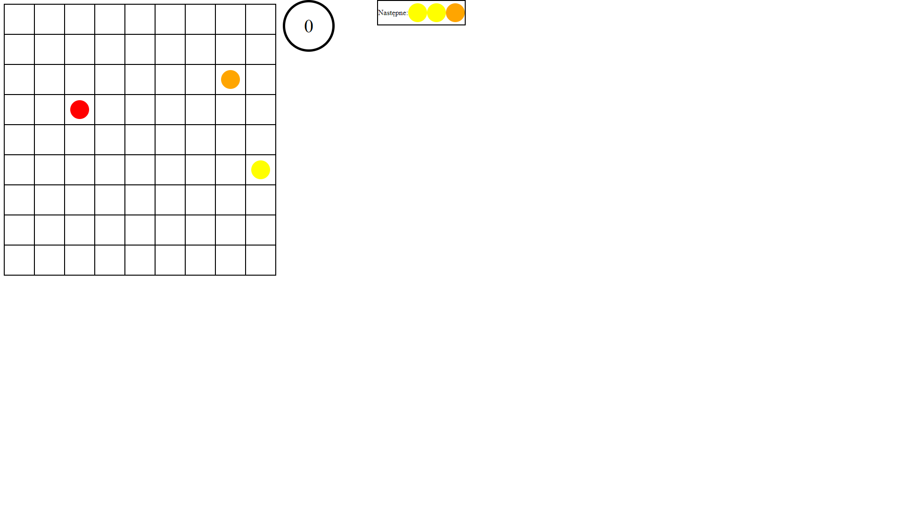
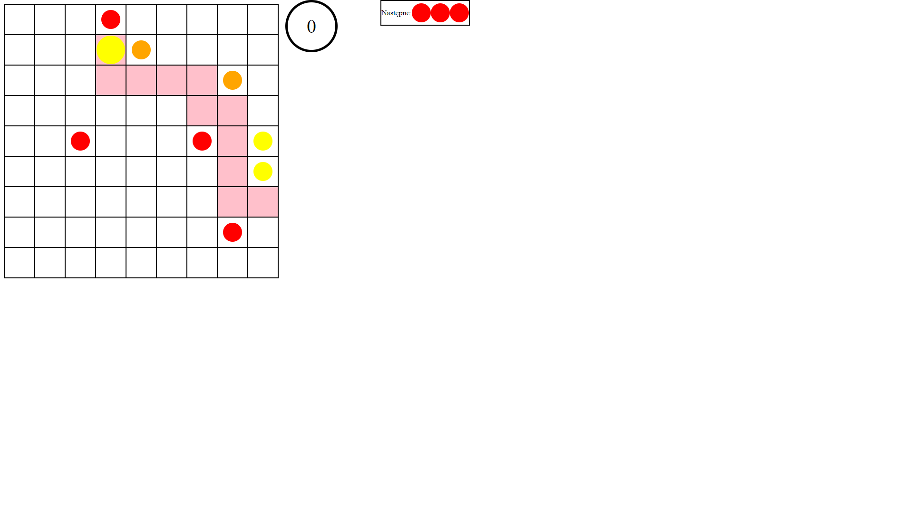
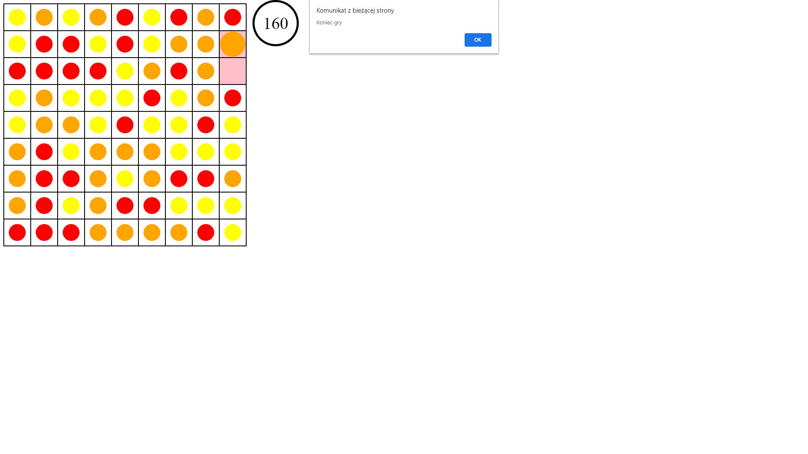

# Gra w "Kulki" wykonana w języku TypeScript

# Opis
Gra polega na ułożeniu w poziomie, pionie lub na skos co najmniej 5 kulek tego samego koloru.
Co każdy ruch na planszy pojawiają się kolejne 3 kulki.
Gra kończy się, gdy zabraknie miejsca dla kolejnych kulek.

 
 
